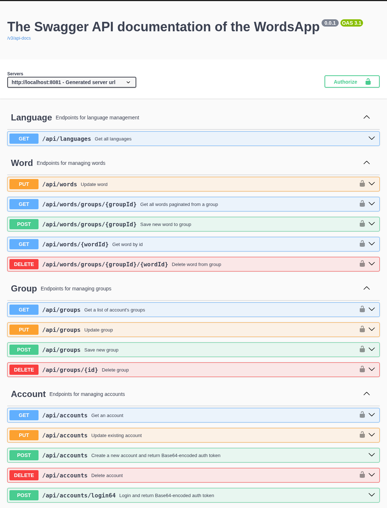
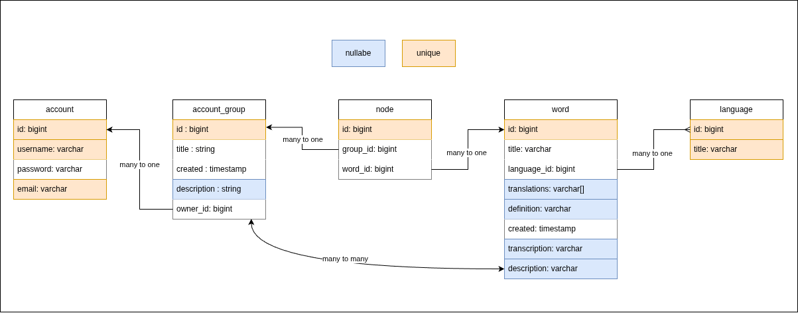

# Version 0.0.1

## Description
Current version acts as the MVP (minimal working product) and ships the
minimal (but tested) functionality. It uses the Docker compose to conteinerize 
Spring Boot app and PostgreSQL database.

## Table of contents
1. [Features](#features)
2. [Bugs, errors, TODOs](#bugs-errors-todos)
3. [State](#state)
4. [API and Swagger](#api-and-swagger)
5. [How to run app](#how-to-run-app)
6. [How to build app](#how-to-build-app)

## Features
* Almost 100% test coverage ("almost" because it's just an MVP)
* Base functionality
* Base64 security (will be replaced in the future releases with a better one)
* Nice exception handling for the beginning 
* Profiles for all 3 cases: `dev`, `prod`, and `test`
* Only integration tests

## Bugs, errors, TODOs
* The exception response is not *very*
* The account doesn't support Spring Security's `UserDetails` features such as enabled, expired, locked etc
* There is no email verification for account during creation
* There is no way to reset password
* `@Transactional` in the `#delete` method of `DefaultWordService` was removed, since when is called from the controller the `TransientObjectException` appears
* No `null` checks!

## State
### Swagger UI

### Architecture

### Database Schema

## API and Swagger
As mentioned current version ships the Base64 Security. If the `api-docs.json`
file is not enough for you and you'd like to get more info, start the app
and visit the Swagger's endpoint: `/swagger-ui/index.html`. That page is 
autogenerated by the Swagger. 

## How to Run App?
You can run app in one of the following profies: `dev`, `test`, `prod`. Before running
make sure the required profile files (like `/config/.env.<PROFILE>`, 
`/docker/docker-compose.<PROFILE>.yml`) exist.

### Method 1: quickly and without source code
Great if you are not a developer. 

1. Create a folder for config files
2. Download the toolkit (it contains the docker image, scripts, compose files)
from the Github, it ends with `.tar.gz`. **It contains the default `config/.env.dev` 
file to quickly run app, keep in mind that you might want to change it**
3. Run `docker load -i <image name>.gz`
4. Run `scripts/docker-run dev` and say `y` on the "Have you build the app before?" prompt

### Method 2: outside Docker (with source code)
Great for local usage. It means to runs as you'd type: `./gradlew bootRun`, 
but with wrappers and checks

Just run the `run.sh <profile>` and follow instructions. App runs locally 
on your host and  database in container.

But what happens under the hood?
* It checks config files
* Applies env vars
* Stops another containers
* Locally overrides datasource url
* Starts docker profile-specific DB container

How it runs app?
1. `dev` or `prod` profiles simply: `./gradlew clean bootRun`
2. `test` via `./gradlew clean test <ARGS>`, so if something breaks, then you see a 
poor output, but it's not neccessary. <u>Consider testing app via your IDE</u>, 
unless you speicifed an argument, like `--info` when asked

### Method 3: inside Docker (with soure code)
Run `docker-run.sh <profile>` and follow instructions. 

Unless you said not to, app will be **built** and runned in the Docker container. 

### Method 4: via IDE (with source code)
1. Specify configuration file (remind where is it: `/config.env.<profile>`)
2. Override the `SPRING_DATASOURCE_URL` env var to `jdbc:postgresql://localhost:${POSTGRES_HOST_PORT}/wordsapp`
3. Run `docker-db-run.sh <profile>` to run profile-specific DB container
4. Run app

## How to Build App?
### Method 1: just get executable jar
Run `build-jar.sh`, and follow instructions, it won't run any tests

### Method 2: build the an image for production
Keep in mind that some other scripts also do that to run the app (the jar file)
inside! But this method does all checks (such as tests) before make an image, it's
like full build.

Run `docker-build.sh` - it will prepare the app to the production. Under the 
hood it does:
* Check config files
* Runs tests (about DB: it starts and then stops test DB container, the stdin of 
`./gradlew test` is redirected to the log file)
* Builds the jar file
* Tags created image (with the version)